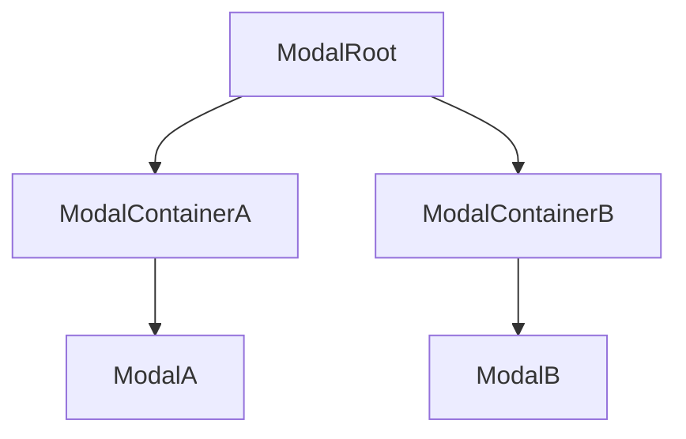
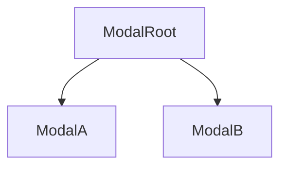
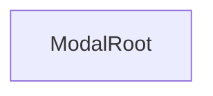

# Vistas

Existen 2 posibles configuraciones, se puede optar por una combinacion de las configuraciones en funcion del tipo de modal que se monte.
- Modal Root que monta diferentes modalContainers y Modales (o recuerda que los Modales pueden contener un container en si mismos Ej:2)
- Modal Root que ya actua como modalContainer y modal

Algunos ejemplos:
<div align='center' style={{display: 'flex', justifyContent: 'center', alignItems: 'center', gap: '2rem'}}>





</div>

### ModalRoot

Ubicacion donde se van a renderizar la vista (o las vistas).

#### Props

##### animation
Hay un lista de animaciones por defecto, pero puedes definir la animacion que gustes! Por defecto cualquier animacion que declares va a extender de la animacion fade, por lo tanto la animacion va a tener ciertas props por default, ejemplo una duracion de 300ms, pero obviamente puedes redifinir todo a tu gusto.

##### ...extenalProps
Mediante esta prop puedes compartir estado del padre donde se renderice el ModalRoot hacia las vistas (ModalContainers-Modals).
No recomiendo el uso de esta prop, idealmente pasarle las props necesarias via el Show method, o utilizar distintas tecnicas de estado, como swr, react-query, zustand, redux, etc.

#### Ejemplo

```tsx
import { ModalRoot } from "decl-modal/react"

//Render
<ModalRoot modalFactory={myGenericModal} animation='fade' />
```

### ModalContainer
Esta tipo de Component no es estrictamente necesario, ya que los Modal pueden tener definido en si mismo un ModalContainer. La idea de este componente es si van a renderizar distintos modales con un tipo de vista especifico, utilizarlos, como un "Layout".<br/>
Los ModalContainer definen el como se va a renderizar las vistas, por ejemplo en un modal tipico, mostrar un fondo con opacidad y una vista centrada.<br/>
#### Ejemplo
```tsx
import { ModalPopUpContainer } from "decl-modal/react"
 
// ... exmaple modal container
```
La idea de esta libreria es no proveer ningun tipo de UI para que puedas montar cualquier tipo de vista, sin depender de ninguna prop especifica. Por lo tanto puedes montar tus propios ModalContainer.

### Modal
Los modales ya son como tal la vista final que se renderiza, el contenido del mismo modal, los Modal en si tambien pueden ser ModalContainers, no tienen por que estas 2 ui estar separadas.