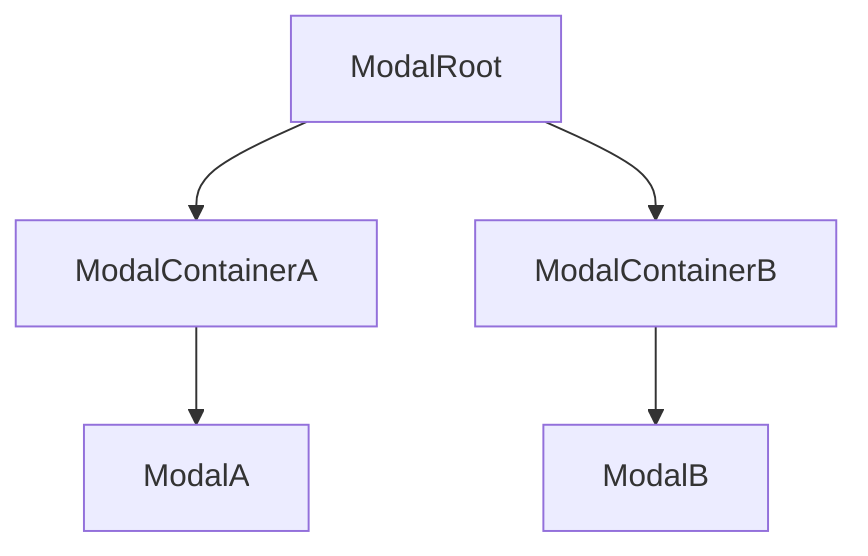
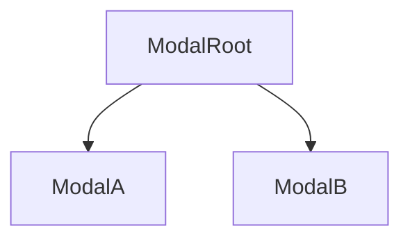

# Views

There are 2 possible configurations, you can opt for a combination of configurations depending on the type of modal to be mounted.
- Modal Root that mounts different modalContainers and Modals (or remember that Modals can contain a container within themselves E.g.:2)
- Modal Root that already acts as a modalContainer and modal

Some examples:
<div align='center' style={{display: 'flex', justifyContent: 'center', alignItems: 'center', gap: '2rem'}}>



</div>

### ModalRoot

Location where the view (or views) will be rendered. You can get a ModalRoot using the generateModal method.

#### Props

##### animation
There is a list of default animations, but you can define the animation you like! By default, any animation you declare will extend from the fade animation, so the animation will have certain default props, for example, a duration of 300ms, but obviously, you can redefine everything as you wish.

##### ...extenalProps
Through this prop, you can share the state of the parent where the ModalRoot is rendered with the views (ModalContainers-Modals).
I do not recommend the use of this prop, ideally pass the necessary props via the Show method, or use different state techniques, such as swr, react-query, zustand, redux, etc.

#### Example

```tsx
//Render
<ModalRoot animation='fade' />
```

### ModalContainer
This type of Component is not strictly necessary, since the Modal can have a ModalContainer defined within itself. The idea of this component is if you are going to render different modals with a specific type of view, use them as a "Layout".<br/>
The ModalContainers define how the views will be rendered, for example, in a typical modal, display a background with opacity and a centered view.<br/>
#### Example
```tsx
import { ModalPopUpContainer } from "@nazfy/modal/react"
 
// ... example modal container
```
The idea of this library is not to provide any kind of UI so that you can mount any type of view, without depending on any specific prop. Therefore, you can mount your own ModalContainers.

### Modal
The modals are the final view that is rendered, the content of the modal itself, the Modals themselves can also be ModalContainers, these 2 UIs do not have to be separated.